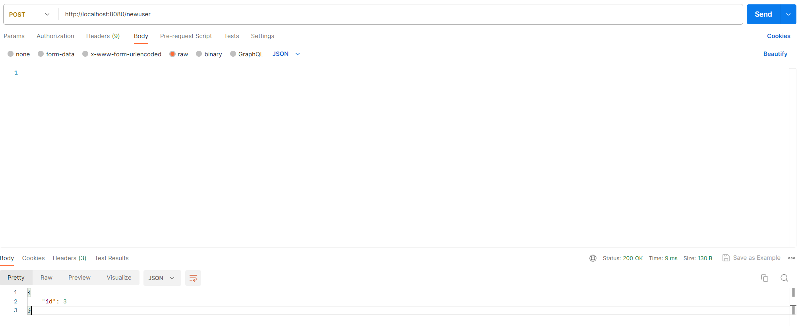
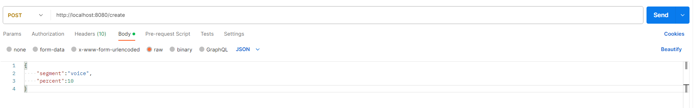
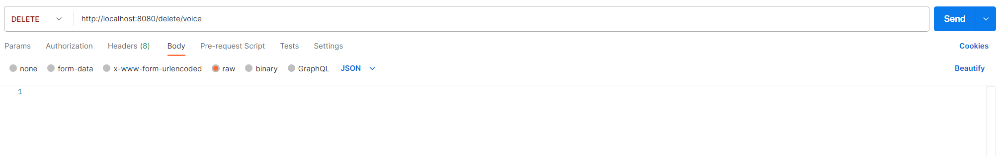
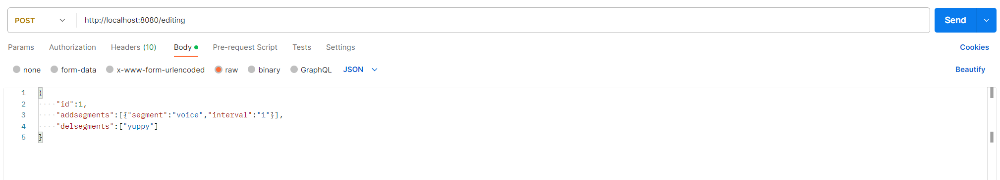
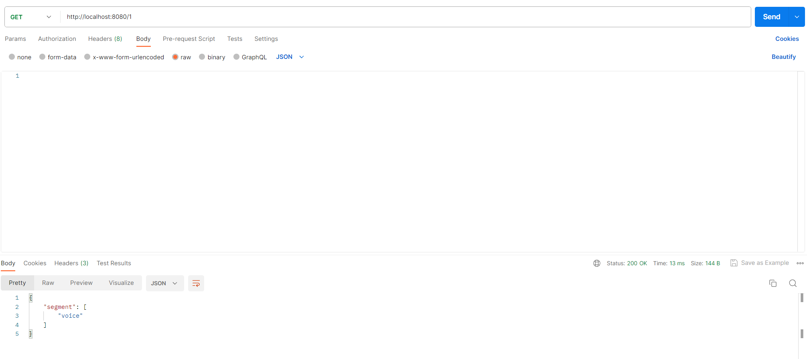
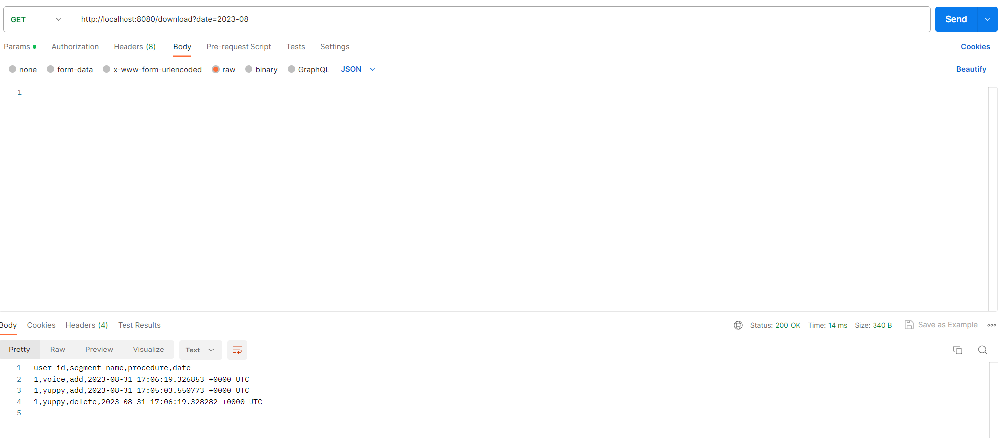

<div align="center">
    <h1>Динамическое сегментирование пользователей</h1>
</div>

---

## Используемые библиотеки и фреймворки:
- `gin`
- `pgx`
- `godotenv`

---

## Схема БД


---

## Запуск
Чтобы запустить приложение, необходимо выполнить следующую команду в корне репозитория:

```
make run
```

Остановить можно командой:

```
make stop
```

---

## Запросы:
Все полные примеры запросов будут представлены в postman
## Создание пользователя

## Создание сегмента

## Удаление сегмента

## Добавление или удаление пользователя из сегмента

## Получение информации о пользователе

## Скачивание отчета
